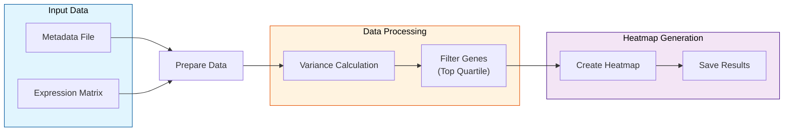

# README
Acute Myeloid Leukemia Heatmap Analysis

This repository contains an analysis pipeline for creating heatmaps from RNA-seq data of acute myeloid leukemia (AML) samples. The analysis focuses on identifying gene expression patterns across different treatment conditions and mutations.

###  Dataset Description

- Contains 19 AML model mice samples
- RNA-seq data processed and quantile normalized by refine.bio
- Samples include various treatment conditions and mutations
- Original dataset source: [Shih et al., 2017](https://pubmed.ncbi.nlm.nih.gov/28193779/)

###  Analysis Pipeline

The analysis follows several key steps:

Data Preparation- Creates structured directory organization
- Imports gene expression matrix and metadata
- Ensures sample order consistency

Gene Selection- Calculates gene variance across samples
- Selects top quartile genes based on variance
- Saves selected genes for further analysis

Heatmap Generation- Creates annotated heatmaps using pheatmap
- Includes mutation status and treatment annotations
- Applies row-wise scaling for better visualization

###  Workflow Overview




The workflow diagram above illustrates the analysis pipeline, where:

- Input data consists of two files: metadata containing sample information and expression matrix with gene measurements
- Data preparation involves reading and aligning these files to ensure consistent sample ordering
- Gene filtering selects the top quartile based on variance to highlight genes showing significant differential expression
- Final heatmap generation combines filtered data with annotations for clear visualization of expression patterns

###  Technical Requirements

- R environment with required packages:
  - pheatmap
  - magrittr
  - readr
  - tibble
  - dplyr


###  Usage Instructions

Clone the repositoryInstall required packages```r
if (!("pheatmap" %in% installed.packages())) {
    install.packages("pheatmap")
}
library(pheatmap)
library(magrittr)
library(readr)
library(tibble)
library(dplyr)
```

Run the analysis pipeline- Creates necessary directories
- Downloads and processes data
- Generates heatmap visualization
- Saves results in specified directories

###  Output Files

- Heatmap visualization saved as PNG in plots directory
- Filtered genes saved as TSV in results directory
- Session information for reproducibility

###  Citation

This analysis adapts methodology from the refine.bio-examples notebook 2:5 and uses data from Shih et al., 2017 2:5.

###  Contributing

Contributions are welcome! Please submit pull requests with clear documentation of changes.
